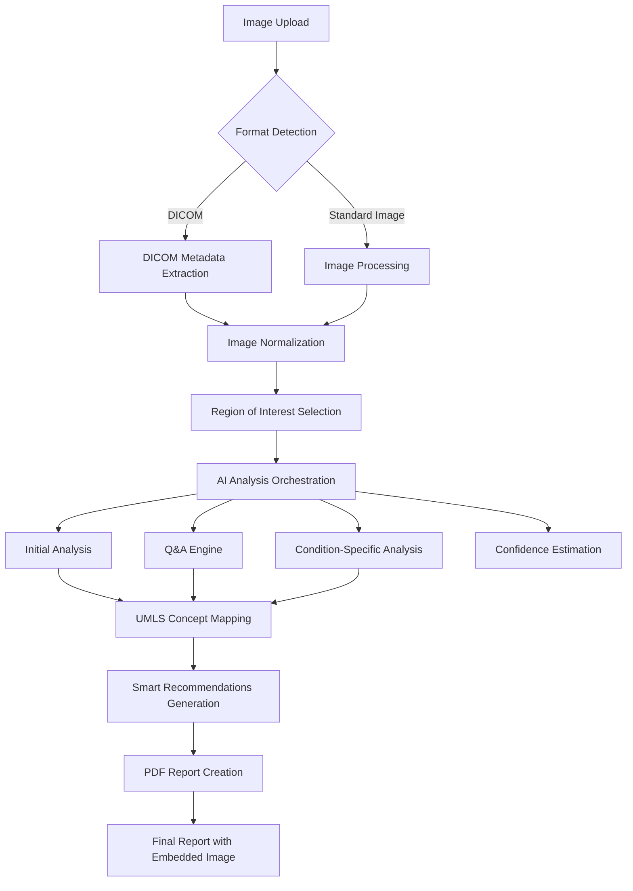
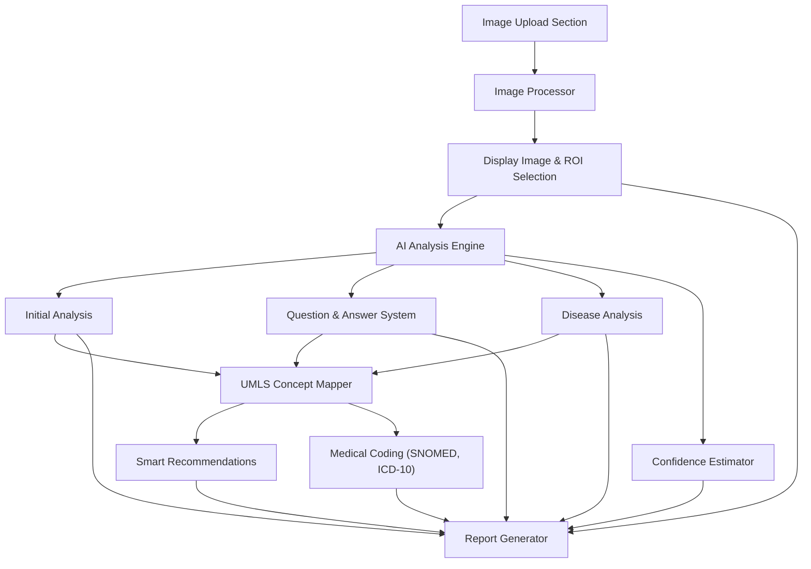
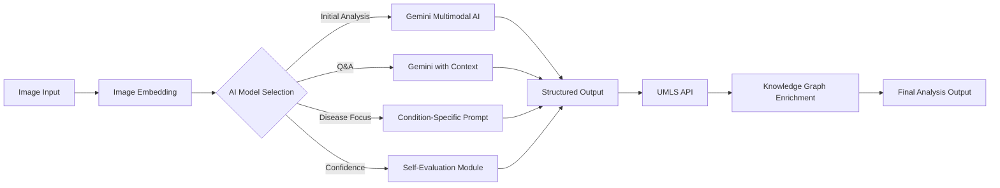
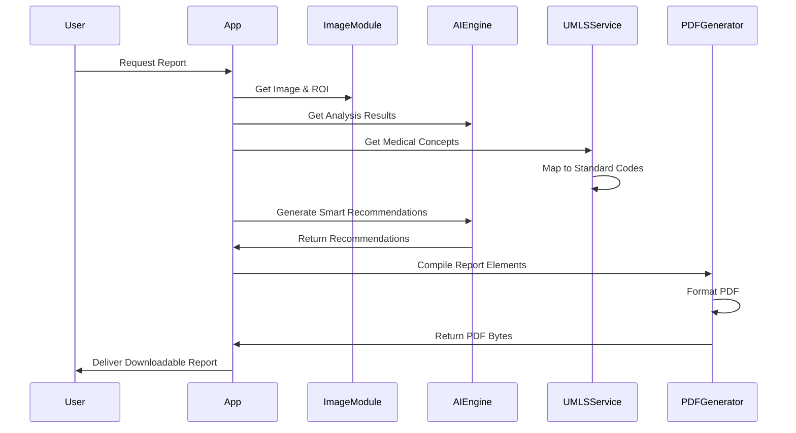

# RadVision AI Technical Pipeline

## Core Processing Pipeline

```mermaid
graph TD
    A[Image Upload] --> B{Format Detection}
    B -->|DICOM| C[DICOM Metadata Extraction]
    B -->|Standard Image| D[Image Processing]
    C --> E[Image Normalization]
    D --> E
    E --> F[Region of Interest Selection]
    F --> G[AI Analysis Orchestration]
    
    G --> H[Initial Analysis]
    G --> I[Q&A Engine]
    G --> J[Condition-Specific Analysis]
    G --> K[Confidence Estimation]
    
    H --> L[UMLS Concept Mapping]
    I --> L
    J --> L
    
    L --> M[Smart Recommendations Generation]
    M --> N[PDF Report Creation]
    
    N --> O[Final Report with Embedded Image]
```

## Data Flow Architecture

```mermaid
flowchart TD
    UploadSection["Image Upload Section"] --> ImageProcessor["Image Processor"]
    ImageProcessor --> DisplayImage["Display Image & ROI Selection"]
    
    DisplayImage --> AnalysisEngine["AI Analysis Engine"]
    
    AnalysisEngine --> InitialAnalysis["Initial Analysis"]
    AnalysisEngine --> QASystem["Question & Answer System"]
    AnalysisEngine --> DiseaseAnalysis["Disease Analysis"]
    AnalysisEngine --> ConfidenceEstimator["Confidence Estimator"]
    
    InitialAnalysis --> UMLSMapper["UMLS Concept Mapper"]
    QASystem --> UMLSMapper
    DiseaseAnalysis --> UMLSMapper
    
    UMLSMapper --> SmartRec["Smart Recommendations"]
    UMLSMapper --> MedicalCoding["Medical Coding (SNOMED, ICD-10)"]
    
    SmartRec --> ReportGenerator["Report Generator"]
    MedicalCoding --> ReportGenerator
    InitialAnalysis --> ReportGenerator
    QASystem --> ReportGenerator
    DiseaseAnalysis --> ReportGenerator
    ConfidenceEstimator --> ReportGenerator
    DisplayImage --> ReportGenerator
```

## AI Integration Components

```mermaid
graph LR
    A[Image Input] --> B[Image Embedding]
    B --> C{AI Model Selection}
    C -->|Initial Analysis| D[Gemini Multimodal AI]
    C -->|Q&A| E[Gemini with Context]
    C -->|Disease Focus| F[Condition-Specific Prompt]
    C -->|Confidence| G[Self-Evaluation Module]
    
    D --> H[Structured Output]
    E --> H
    F --> H
    G --> H
    
    H --> I[UMLS API]
    I --> J[Knowledge Graph Enrichment]
    J --> K[Final Analysis Output]
```

## Report Generation Process

```mermaid
sequenceDiagram
    participant User
    participant App
    participant ImageModule
    participant AIEngine
    participant UMLSService
    participant PDFGenerator
    
    User->>App: Request Report
    App->>ImageModule: Get Image & ROI
    App->>AIEngine: Get Analysis Results
    App->>UMLSService: Get Medical Concepts
    
    UMLSService->>UMLSService: Map to Standard Codes
    
    App->>AIEngine: Generate Smart Recommendations
    AIEngine->>App: Return Recommendations
    
    App->>PDFGenerator: Compile Report Elements
    PDFGenerator->>PDFGenerator: Format PDF
    PDFGenerator->>App: Return PDF Bytes
    App->>User: Deliver Downloadable Report
```
